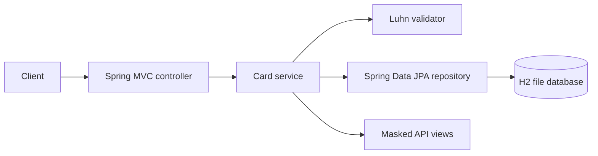
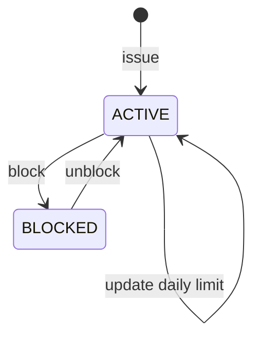

# CardLifecycleApi

CardLifecycleApi is a Java 17 and Spring Boot service for a demo card lifecycle. It issues Luhn-valid test PANs, exposes only masked PAN values, maintains a daily spending allowance, and supports block and unblock operations.

It uses an H2 file database through Spring Data JPA, so cards and their current daily spend survive an application restart. This is a portfolio project, not a payment processor.

## What it does

| Capability | Status |
| --- | --- |
| Issue Luhn-valid demo cards and return masked PANs | Implemented |
| Persist cards and daily authorization state with H2/JPA | Implemented |
| Block and unblock cards | Implemented |
| Set a positive daily limit | Implemented |
| Authorize spending within the remaining daily limit | Implemented |
| Validate a submitted PAN without returning it | Implemented |
| Real issuer, network, settlement, or reversal processing | Not included |
| Authentication, authorization, PCI DSS controls, encrypted PAN storage | Not included |

## Architecture



## Lifecycle



## Run locally

```bash
./mvnw spring-boot:run
```

On Windows:

```powershell
.\mvnw.cmd spring-boot:run
```

The API listens on port `8082`. Run the verification suite with `./mvnw test`.

## API

| Method | Path | Description |
| --- | --- | --- |
| `POST` | `/api/cards` | Issue a card |
| `GET` | `/api/cards` | List cards |
| `GET` | `/api/cards/{cardId}` | Get a card |
| `POST` | `/api/cards/{cardId}/block` | Block a card |
| `POST` | `/api/cards/{cardId}/unblock` | Unblock a card |
| `POST` | `/api/cards/{cardId}/limit` | Change the daily limit |
| `POST` | `/api/cards/{cardId}/authorize` | Record an authorization |
| `POST` | `/api/cards/validate` | Validate a PAN with Luhn |
| `GET` | `/api/cards/health` | Service health |

## Example authorization

```bash
curl -X POST http://localhost:8082/api/cards/CARD-XXXXXXXX/authorize \
  -H "Content-Type: application/json" \
  -d '{ "amount": 125.50 }'
```

An accepted authorization returns its amount, `spentToday`, and `availableDailyLimit`. A blocked card or an amount above the remaining daily limit returns HTTP 409.

## Security boundaries

- API responses never include a full PAN. Card views include `maskedPan`, and PAN validation returns only `panLast4`.
- Responses receive `Cache-Control: no-store`, anti-framing, MIME-sniffing, referrer, and restrictive content-security headers.
- Request payloads validate required text and positive, two-decimal monetary amounts.
- PAN values are stored in clear text in the local H2 demo database. Production storage requires PCI DSS-approved tokenization or encryption with managed keys; this project does not claim that protection.

## License

MIT, see [LICENSE](LICENSE).
