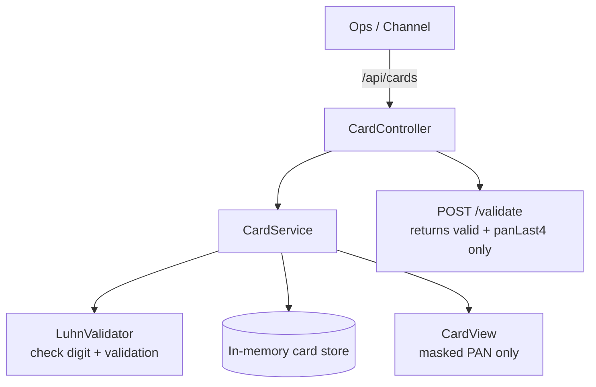
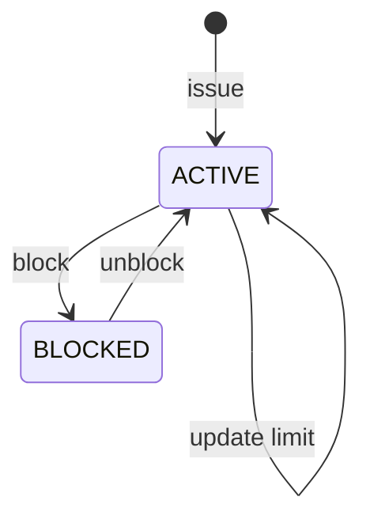
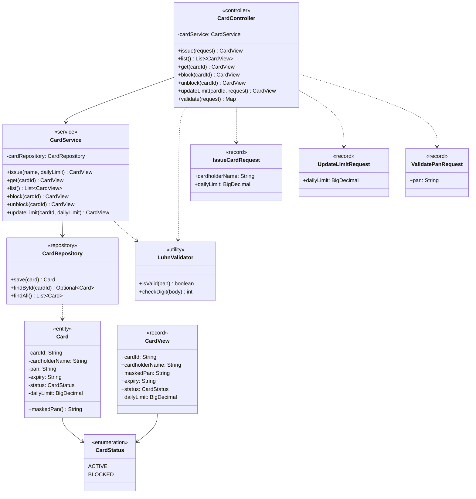

# Card Management Service

Card issuance and lifecycle microservice: issue **demo** cards with a Luhn-valid PAN (test IIN `400000`), mask the number, manage daily limits, and block / unblock.

Built with **Java 17** and **Spring Boot 3**. Cards are persisted to an **H2 file database** (via Spring Data JPA) so issued cards survive a restart, with zero external infrastructure to run.

> Educational demo only. Not PCI DSS compliant. Generated PANs use a documented test IIN and must never be treated as real card numbers.

## Scope (honest)

This is a learning / portfolio service, not a production card platform.

| Capability | Status |
|------------|--------|
| Issue a Luhn-valid demo card, mask PAN, manage limits, block/unblock | Implemented |
| H2 file persistence of cards (survives restart) | Implemented |
| Luhn PAN validation endpoint | Implemented |
| Real card network / issuer processor integration | Not included |
| PCI DSS controls (tokenization, HSM, encrypted storage) | Not included |
| AuthN/AuthZ on the API | Not included |

## Architecture



## Card lifecycle



## Features

- Issue cards with a generated **Luhn-valid** demo PAN (test IIN `400000`) and expiry
- Full PAN never leaves the API; card views expose a masked PAN only
- Validate endpoint returns `{ valid, panLast4 }` — never echoes the full PAN
- Daily limit updates
- Block / unblock lifecycle
- Cards persisted to an H2 file database — issued cards survive a restart

## Domain model

Class-level view of the main types and how they relate (fields, operations and dependencies).



## Quick start

```bash
./mvnw spring-boot:run      # Linux / macOS
mvnw.cmd spring-boot:run    # Windows
```

Run tests:

```bash
./mvnw test
```

## Example flow

```bash
# Issue a card
curl -s -X POST http://localhost:8082/api/cards \
  -H "Content-Type: application/json" \
  -d '{ "cardholderName": "Ada Lovelace", "dailyLimit": 8000 }'

# Validate a PAN with the Luhn algorithm
curl -s -X POST http://localhost:8082/api/cards/validate \
  -H "Content-Type: application/json" \
  -d '{ "pan": "4111111111111111" }'

# Block / unblock (use the cardId from issue)
curl -s -X POST http://localhost:8082/api/cards/CARD-XXXXXXXX/block
curl -s -X POST http://localhost:8082/api/cards/CARD-XXXXXXXX/unblock
```

## API

| Method | Path | Description |
|--------|------|-------------|
| `POST` | `/api/cards` | Issue a card |
| `GET` | `/api/cards` | List cards |
| `GET` | `/api/cards/{id}` | Get a card |
| `POST` | `/api/cards/{id}/block` | Block a card |
| `POST` | `/api/cards/{id}/unblock` | Unblock a card |
| `POST` | `/api/cards/{id}/limit` | Update daily limit |
| `POST` | `/api/cards/validate` | Luhn-validate a PAN |
| `GET` | `/api/cards/health` | Health check |

## Design notes

- PANs are generated on a demo BIN and completed with a computed Luhn check digit
- Only masked PANs (`**** **** **** 1234`) leave the service
- Storage is an H2 file database (`./data/card-management.mv.db`, gitignored) via Spring Data
  JPA; `spring.jpa.hibernate.ddl-auto=update` lets the schema self-create on first run

## License

MIT — see [LICENSE](LICENSE).
