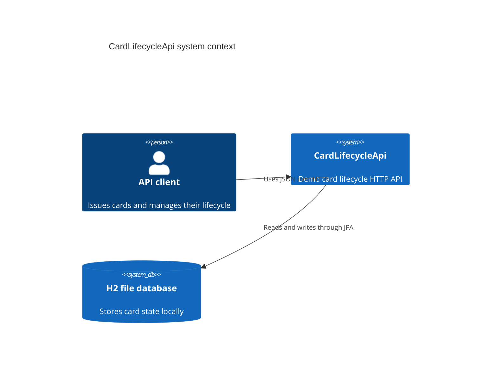
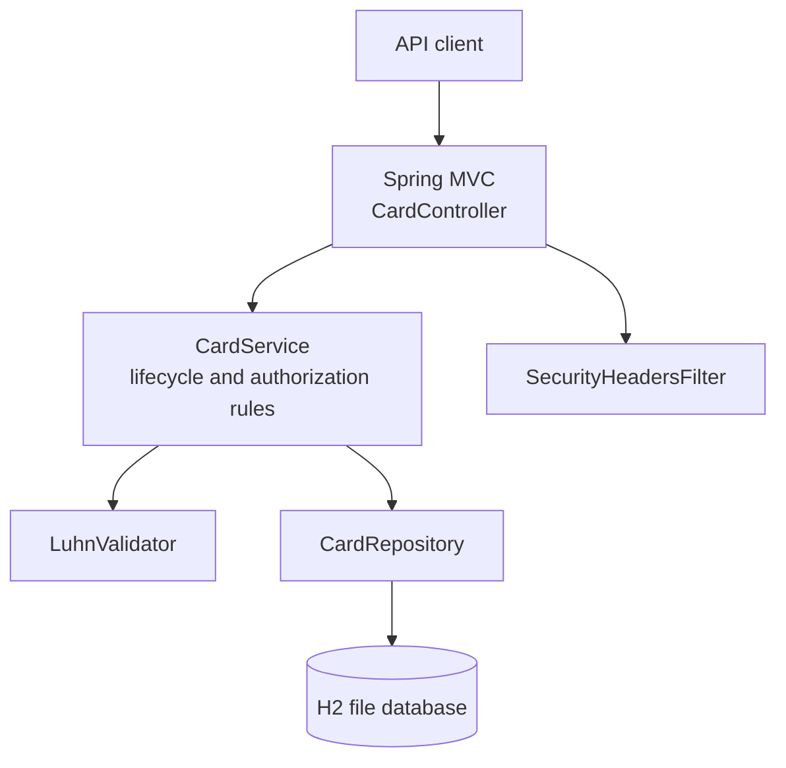

# Architecture

## Scope

CardLifecycleApi is a single Spring Boot application. It models demo cards and their daily authorization allowance. The application does not connect to an issuer, card network, payment gateway, or identity provider.

## C4-style context

## Container view

## Authorization rule

For each card, the persisted state holds a daily limit, amount spent today, and the date that spend applies to. The service resets the spend amount when the calendar date changes, rejects blocked cards, then rejects amounts greater than `dailyLimit - spentToday`. Accepted amounts increase `spentToday` in the same transaction.

JPA optimistic locking protects the card row from silent lost updates when concurrent authorization requests modify the same card.

## Data protection boundary

The API projects `CardView` and `AuthorizationView` records rather than serializing the entity. Full PAN values are therefore not returned by card endpoints. The local H2 database retains a plaintext demo PAN by design, which is explicitly outside PCI DSS scope.

## Verification

The test suite includes algorithm tests, service unit tests, MockMvc endpoint tests, and a restart test against an H2 file database. The authorization tests cover successful spending, blocked cards, and over-limit declines.
