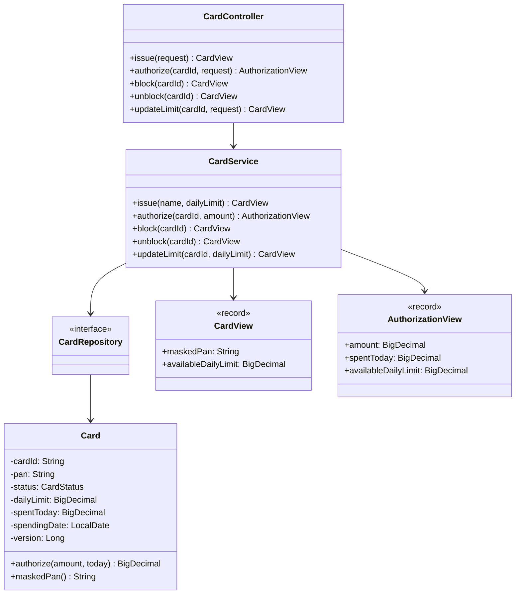
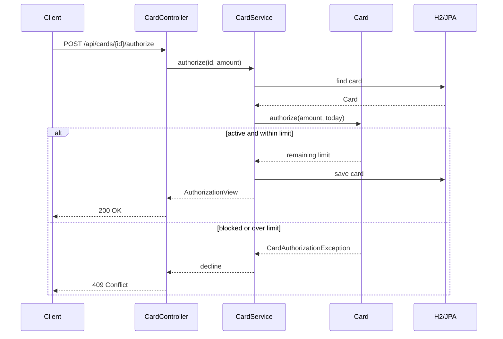

# UML

```mermaid
classDiagram
    class CardController {
        +issue(request) CardView
        +authorize(cardId, request) AuthorizationView
        +block(cardId) CardView
        +unblock(cardId) CardView
        +updateLimit(cardId, request) CardView
    }

    class CardService {
        +issue(name, dailyLimit) CardView
        +authorize(cardId, amount) AuthorizationView
        +block(cardId) CardView
        +unblock(cardId) CardView
        +updateLimit(cardId, dailyLimit) CardView
    }

    class Card {
        -cardId: String
        -pan: String
        -status: CardStatus
        -dailyLimit: BigDecimal
        -spentToday: BigDecimal
        -spendingDate: LocalDate
        -version: Long
        +authorize(amount, today) BigDecimal
        +maskedPan() String
    }

    class CardRepository {
        <<interface>>
    }

    class CardView {
        <<record>>
        +maskedPan: String
        +availableDailyLimit: BigDecimal
    }

    class AuthorizationView {
        <<record>>
        +amount: BigDecimal
        +spentToday: BigDecimal
        +availableDailyLimit: BigDecimal
    }

    CardController --> CardService
    CardService --> CardRepository
    CardRepository --> Card
    CardService --> CardView
    CardService --> AuthorizationView
```

```mermaid
sequenceDiagram
    participant Client
    participant Controller as CardController
    participant Service as CardService
    participant Card
    participant DB as H2/JPA

    Client->>Controller: POST /api/cards/{id}/authorize
    Controller->>Service: authorize(id, amount)
    Service->>DB: find card
    DB-->>Service: Card
    Service->>Card: authorize(amount, today)
    alt active and within limit
        Card-->>Service: remaining limit
        Service->>DB: save card
        Service-->>Controller: AuthorizationView
        Controller-->>Client: 200 OK
    else blocked or over limit
        Card-->>Service: CardAuthorizationException
        Service-->>Controller: decline
        Controller-->>Client: 409 Conflict
    end
```
